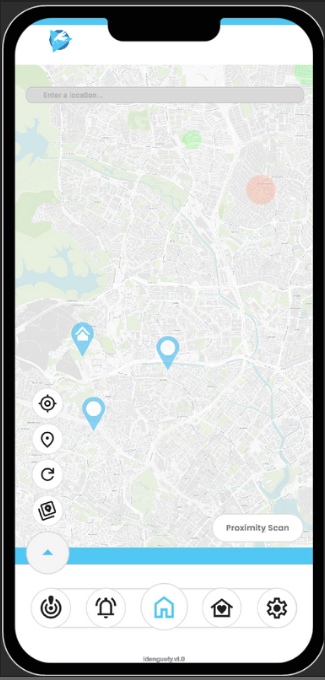

# *Idenguefy*
*Welcome to the official repository for Idenguefy, a Smart Nation application to visualize dengue clusters in Singapore*
<p align="center"></p>

<details>
<summary>Demo Video</summary>
<a href="https://www.youtube.com/watch?v=k8CcRQeC6BA" > Link to Demo video</a>
</details>

**Table of Contents**
- [Idenguefy](#*Idenguefy*)
- [Overview](#Overview)
- [Project Architecture](#Project-Architecture)
- [Repository Setup Instructions](#Repository-Setup-Instructions)
- [APK Setup Instructions](#Idenguefy-APK-Setup-Instructions)
- [Team Members](#Team-Members)
- [External API References](#External-API-References)
- [References](#References)

## Overview
Idenguefy is a Unity-based application that provides users with real-time information on active dengue clusters in Singapore. It integrates with government open data sources and aims to raise public health awareness by delivering:  
- Interactive dengue cluster maps  
- Location-based alerts  
- Preventive health tips  
- Personalization options  

This project is developed as part of **NTU SC2006 Software Engineering (Lab Project)**  

---
## Project Architecture  
We follow an **Entity–Boundary–Control (EBC)** design (MVC-style).  

```
Idenguefy/
 └── IdenguefyDocs/                 # Accessible from `Index.html`
 └── Idenguefy/
		 ├──Packages/
		 ├──ProjectSettings/
		 └── Assets/
			 └── Scripts/
			     ├── Entity/        # Data classes
			     ├── Control/       # Controllers for app logic
			     └── Boundary/      # UI logic
			 └── Prefabs/           # Reusable UI elements
			 └── Scenes/            # Unity scenes
```

---
# Repository Setup Instructions  
## Prerequisites  
- Unity Hub (recommended)  
- Unity Editor (Unity 6000.2.6f1)  
- Visual Studio (Community) with **Game Development with Unity** workload  
### Steps  
1. Clone the repository:  
   ```bash
   git clone https://github.com/c10se/idenguefy.git
   ```
2. Open Unity Hub → **Add Project from Disk** → select the repo folder.  
3. Open the project in Unity Editor.  

---
# Idenguefy APK Setup Instructions
## Prerequisites
- Android Device (Mobile Phone)
### Steps
1. Download the APK from [here](Idenguefy/APK)
2. Once Idenguefy is installed, enable the following permissions
	- Location
	- Notifications

---

# Team Members  

| Name                          | Github Username                                           |
| ----------------------------- | --------------------------------------------------------- |
| Xavier Lee                    | [trixazo](https://github.com/trixazo)                     |
| So Cheuk Hong                 | [c10se](https://github.com/c10se)                         |
| Rafael Sharina Alessandra Boo | [sabr522](https://github.com/sabr522)                     |
| Eben Lim                      | [ebenl08](https://github.com/ebenl08)                     |
| Satitmannaitham Napatr        | [nap001](https://github.com/nap001)                       |
| Ryan Ng Rui Kai               | [Just-a-coder-2024](https://github.com/Just-a-coder-2024) |

---

# External API References
- [NEA Dengue Cluster Data](https://data.gov.sg/)  
- [MapTiler API](https://docs.maptiler.com/)  
- [Unity Documentation](https://docs.unity3d.com/Manual/index.html)  
- [Microsoft AI translator](https://azure.microsoft.com/en-us/products/ai-services/ai-translator)

# References
- [Doxygen](https://www.doxygen.nl/manual/index.html)
---
*This project is developed for educational purposes as part of SC2006 Software Engineering, Nanyang Technological University.*  
